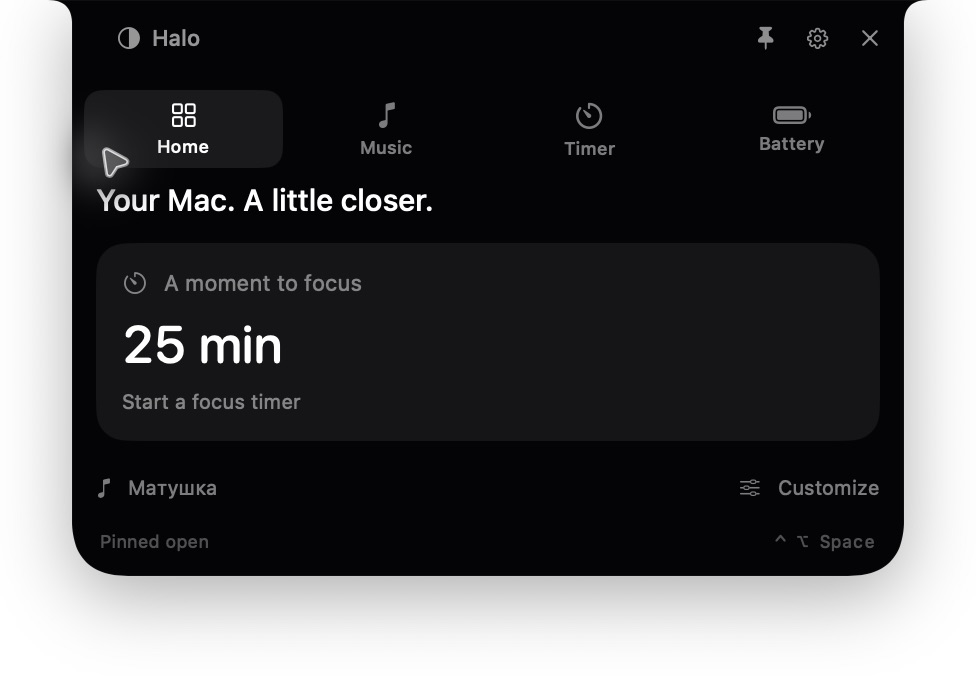

# Halo

A native macOS companion that makes the camera notch a little more useful. Halo blends into the notch at rest, opens with a short spring animation, and keeps your music, battery, and focus within reach.



## Download and install

[Download the Halo beta DMG](https://github.com/Mustafa-khann/Halo/releases/download/v1.0.0-beta.1/Halo-1.0.0.dmg) · [Release notes and checksum](https://github.com/Mustafa-khann/Halo/releases/tag/v1.0.0-beta.1)

1. Open the downloaded DMG and drag **Halo** into **Applications**.
2. Launch **Halo** from Applications. It appears in the menu bar and around the camera notch.
3. Open Settings → Activities to connect Spotify or Apple Music. Volume controls the Mac's system output.

The beta is ad hoc signed and **not notarized by Apple**. macOS may block its first launch because the developer cannot be verified. If you trust this release, after attempting to launch it, use **System Settings → Privacy & Security → Open Anyway** for Halo. See [Apple's instructions for opening an unnotarized app](https://support.apple.com/102445).

Halo supports **macOS 14 or later**, with one universal app for **Apple silicon and Intel**. No developer tools or Python are needed to run the installed app.

To verify the download, place the DMG and its `.sha256` file in the same folder and run:

```sh
shasum -a 256 -c Halo-1.0.0.dmg.sha256
```

## The first release

- Spotify and Apple Music track information, playback controls, and draggable seeking, with optional Automation access.
- Mac system output volume, synchronized with volume keys and changes to the selected audio output. Outputs with hardware-only volume controls show the slider as unavailable.
- Live battery percentage, charging state, and a brief indicator when power is connected or disconnected.
- Focus timers with presets, custom durations, pause/resume, sound, optional notifications, and saved deadlines that survive sleep and relaunch.
- A nonactivating panel, configurable Control–Option–H shortcut, Escape dismissal, pinning, and delayed hover expansion.
- Tabs switch on hover and respond across their full padded area. Battery details live in the Battery tab.
- Native settings, system appearance, Reduce Motion support, launch at login, and a floating fallback for displays without a notch.

Halo requires macOS Sonoma 14 or later. The release bundle includes Apple silicon and Intel binaries. It lives in the menu bar rather than the Dock.

Music is disconnected by default. Connect it in Settings → Activities. macOS asks for Automation permission when Halo first communicates with the selected running player. Halo does not request Accessibility or Screen Recording access, capture keystrokes, or collect analytics. Spotify artwork loads from the artwork URL supplied by Spotify.

## Build and run

Install Apple's command-line developer tools with a Swift 6 or later compiler. No third-party runtime is required by the app.

```sh
scripts/build.sh debug
open dist/Halo.app
```

The debug build targets the current Mac. A release build creates a universal application:

```sh
scripts/test.sh
scripts/build.sh release
scripts/package-dmg.sh
```

The installer script uses Python 3.11 or later and installs its pinned packaging dependencies in `.build/dmg-tools`. Set `HALO_PYTHON` if your Python executable has another name. These dependencies generate the Finder layout and are not shipped or needed by Halo itself.

Outputs are `dist/Halo.app`, `dist/Halo-1.0.0.dmg`, and a SHA-256 checksum. The disk image has a drag-to-Applications layout and custom artwork.

## Signing a notarized release

Without a signing identity, builds are ad hoc signed. That verifies bundle integrity but is not Developer ID signing or Apple notarization. The downloadable beta uses this signing mode.

For a notarized release, use a stable bundle identifier belonging to your project in `Resources/Info.plist`, an Apple Developer ID Application certificate, and Apple's `notarytool` and `stapler`. Store notarization credentials in Keychain with `notarytool store-credentials`; never put them in this repository.

```sh
export SIGNING_IDENTITY='Developer ID Application: Your Name (TEAMID)'
export NOTARY_PROFILE='halo-notary'
scripts/notarize.sh
```

The release script rebuilds and signs both architectures, signs the disk image, submits it for notarization, staples the ticket, checks Gatekeeper assessment, and updates the checksum. No release is uploaded automatically by a normal build.

For a release candidate, manually check music controls with each connected player; Spaces, Stage Manager, full-screen apps, and an auto-hidden menu bar; display scaling, external monitors, and clamshell mode; sleep/wake and timer completion; VoiceOver; and a clean installation on supported Intel and Apple silicon Macs. The core tests cover timer deadlines, persistence, notch coordinates, media progress, and preference defaults. Architecture compilation does not substitute for testing on an Intel Mac.

## Structure

`AppModel` owns persisted preferences and activity state. `PowerService` uses IOKit notifications. `SystemVolumeService` uses Core Audio output-device volume and mute controls, with property listeners for live updates. `MediaService` communicates with each player's published scripting interface on a background queue. `OverlayController` owns display geometry, mouse routing, and public Carbon hotkeys. `HaloView` draws the notch and activity controls; `SettingsView` provides native configuration. Additional activities can be added as independent services and views in later releases.
