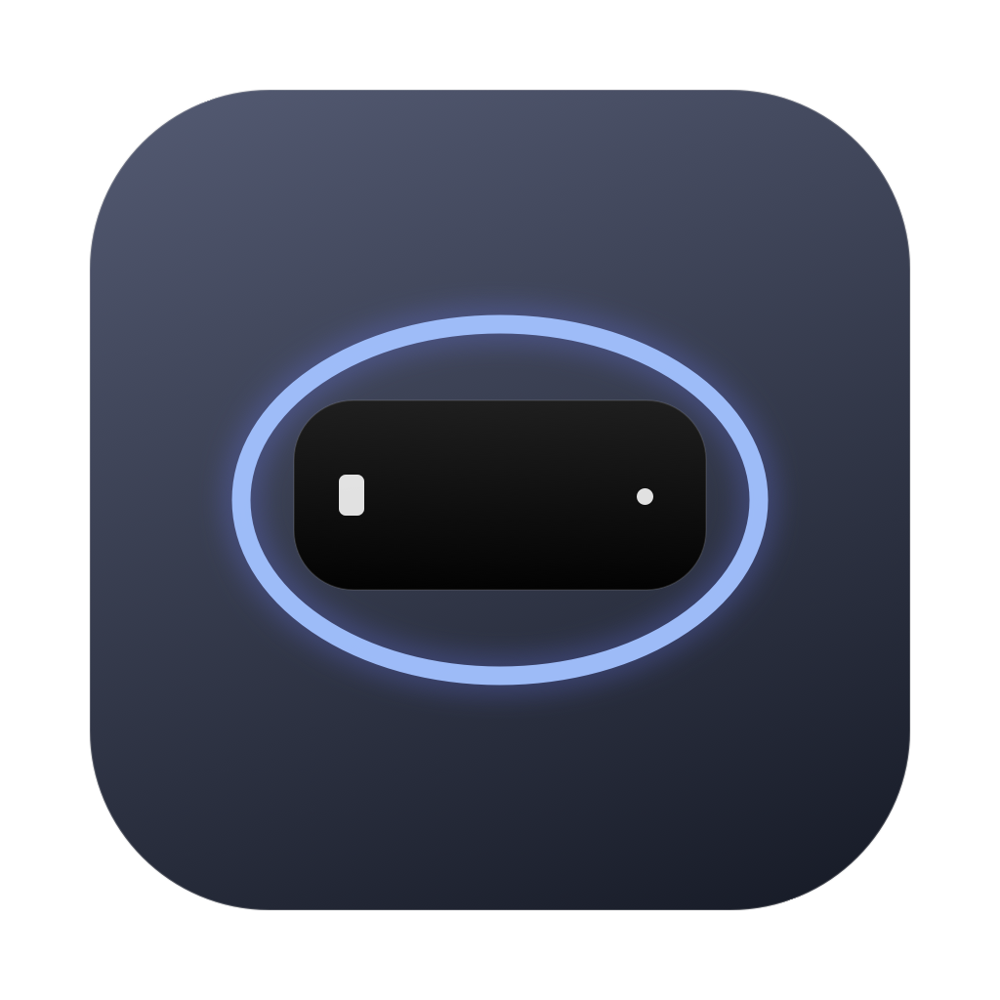

<p align="center">
  
</p>

<h1 align="center">Halo</h1>

<p align="center"><strong>A little more Mac.</strong></p>

<p align="center">
  <a href="https://github.com/Mustafa-khann/Halo/releases/download/v1.2.3-beta.1/Halo-1.2.3.dmg">Download Halo</a>
  ·
  <a href="https://github.com/Mustafa-khann/Halo/releases/tag/v1.2.3-beta.1">What’s new</a>
</p>

Halo brings music, focus, files, and battery information to the space around your Mac’s camera notch. It opens with a hover, gives you room to do a little more, and settles back into the notch when you’re done.

Its frosted glass surface blurs the actual windows or wallpaper behind it. Quiet tabs, soft edges, and gentle feedback make every interaction feel at home on your Mac.

**Current release: 1.2.3 beta.** Requires macOS 14 or later. One app for Apple silicon and Intel, with a floating option for displays without a notch.

## Get started

1. Download the DMG and drag **Halo** into **Applications**.
2. Open Halo from Applications. It lives in the menu bar and around the notch.
3. To connect your music, open **Settings → Activities**, turn on **Music**, and choose your player.

The beta is ad hoc signed and **not notarized by Apple**. If macOS blocks the first launch, and you trust this download, try opening Halo once, then choose **System Settings → Privacy & Security → Open Anyway** for Halo. [Apple’s guide to opening downloaded apps](https://support.apple.com/en-us/102445) explains the process.

You don’t need developer tools or Python to use Halo.

<details>
<summary>Verify your download</summary>

Download the [SHA-256 checksum](https://github.com/Mustafa-khann/Halo/releases/download/v1.2.3-beta.1/Halo-1.2.3.dmg.sha256) and place it beside the DMG. In that folder, run:

```sh
shasum -a 256 -c Halo-1.2.3.dmg.sha256
```

</details>

## Keep the essentials close

**Music, right here.** See what’s playing in Spotify or Apple Music. Play, pause, skip, and scrub through a track. Adjust your Mac’s system volume from the same view. Outputs with hardware-only volume controls show the slider as unavailable.

**A moment to focus.** Start with a 5, 15, 25, or 45-minute timer, or choose your own duration. Pause and resume as needed. Timers keep their place through sleep and app restarts, with sound and optional notifications when time is up.

**A place for your files.** Drop files or folders onto Halo, then drag them into another app, copy them, or reveal them in Finder. Select several items to share with the native AirDrop picker. Your shelf holds up to 20 items and is saved between launches. Removing an item leaves the original in place.

**A little more time.** Keep your Mac awake for 15 minutes, 30 minutes, an hour, two hours, or until you stop the session. You can keep the display awake too. Sessions end when Halo quits or your Mac sleeps. Closing the lid and choosing Sleep still work normally.

**Power, at a glance.** Check your battery level, charging state, and power source in the Battery tab. A brief indicator beside the notch lets you know when power connects or disconnects.

Home brings your focus timer, file shelf, and music shortcuts together. Open a tab when you want more room for an activity.

## Make it yours

- Hover over a tab to switch, or click anywhere within its padded area.
- Click the pin to keep Halo open. Press **Escape** or click outside it to close.
- Press **Control–Option–H** to open or close Halo. Choose another shortcut in Settings.
- Adjust the width, animation, and hover timing in **Settings → Appearance**.
- Choose your activities and launch-at-login preference in Settings.

Halo follows Reduce Motion when enabled in its settings. Reduce Transparency and increased contrast use an opaque surface for readability. Your current app keeps keyboard focus while you use the island.

## Your Mac. Your choice.

No account, subscription, or usage analytics. Music is off until you enable it, and macOS asks for Automation permission before Halo controls your player. Timer notifications are optional.

Halo doesn’t request Accessibility or Screen Recording access, record keystrokes, or upload your file shelf. File references stay on this Mac. Spotify artwork loads from the image URL supplied by Spotify.

## For developers

<details>
<summary>Build, test, and package Halo</summary>

Install Apple’s command-line developer tools with a Swift 6 or later compiler. The app uses SwiftUI, AppKit, and native macOS services.

To build for your current Mac:

```sh
scripts/build.sh debug
open dist/Halo.app
```

To run the tests and create a universal release:

```sh
scripts/test.sh
scripts/build.sh release
scripts/package-dmg.sh
```

The output is `dist/Halo.app`, `dist/Halo-1.2.3.dmg`, and its `.sha256` file. The DMG includes a drag-to-Applications layout.

Packaging requires Python 3.11 or later. The script installs pinned packaging tools in `.build/dmg-tools`; they are not included in the app. Set `HALO_PYTHON` to use a different Python executable.

The 13 core tests cover timers and saved state, display geometry, media progress, preference migration, file shelf limits and drops, preserving original files, and Keep awake deadlines.

### Project layout

- `Sources/Halo` — the app, activity services, native overlay, and settings.
- `Tests/HaloTests` — core behavior tests.
- `Resources` — app artwork, bundle information, and entitlements.
- `scripts` — builds, tests, installer artwork, packaging, and notarization.

`AppModel` connects preferences and services to the interface. `OverlayController` handles display placement, pointer routing, and shortcuts. `HaloDesign` and `HaloBackground` define the shared controls and native backdrop material. Music, system volume, file shelf, and Keep awake have separate services.

</details>

<details>
<summary>Sign and notarize a release</summary>

Without a signing identity, the build uses ad hoc signing. For a notarized release, use an appropriate bundle identifier, a Developer ID Application certificate, and a notarization profile saved in Keychain. Keep certificates and credentials out of the repository.

```sh
export SIGNING_IDENTITY='Developer ID Application: Your Name (TEAMID)'
export NOTARY_PROFILE='halo-notary'
scripts/notarize.sh
```

The script rebuilds both architectures, signs the app and DMG, submits the DMG for notarization, staples and validates the ticket, checks Gatekeeper assessment, and updates the checksum. Building does not publish a release automatically.

Before publishing, check playback and seeking with both players; file drops, dragging, and AirDrop; Keep awake expiry and stopping; timers across sleep and relaunch; Spaces, Stage Manager, and full-screen apps; display scaling and external monitors; VoiceOver; and a clean installation on Apple silicon and Intel Macs. A successful Intel build does not replace testing on Intel hardware.

</details>
